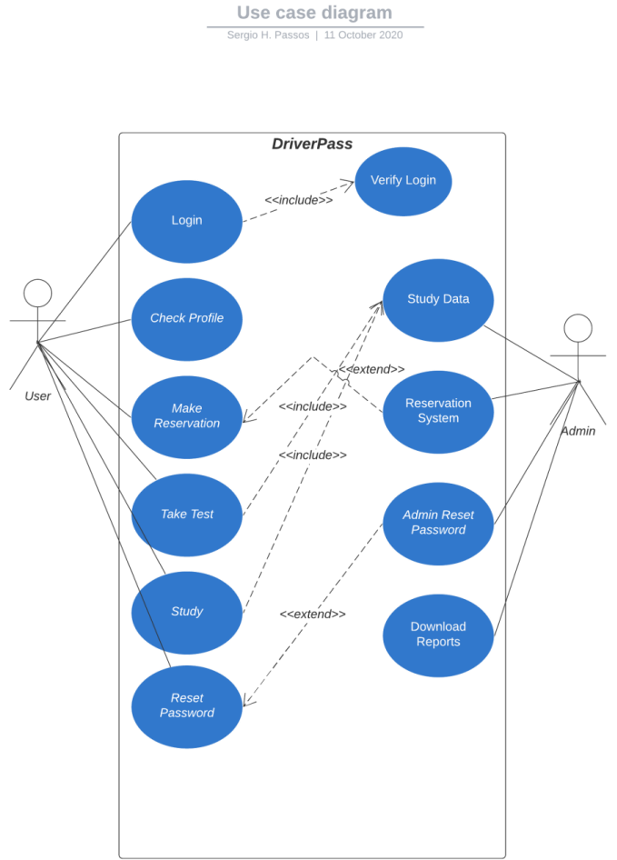
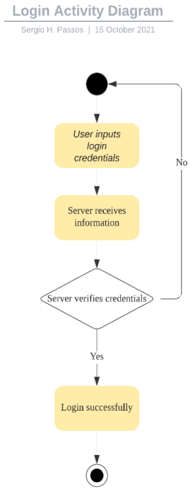
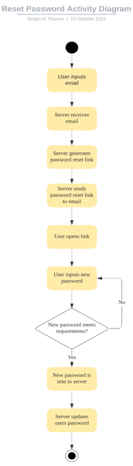
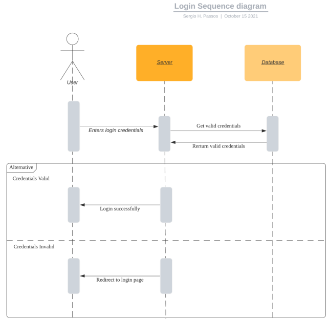

# Business-Requirement--Document
> DriverPass wanted to design a new system for new drivers. An application that would allow customers to study, test, and practice driving. The diagrams help bring to life DriverPass’s vision. Additionally, the business document helps outline small details that the diagram couldn’t capture. I would still want to work further on the diagram and business document. Since work can always be done to tailor and tweak these resources.When designing the application, we took into consideration DriverPass’s users. This was the spear head of our development. Keeping thing simple, yet intuitive keeps DriverPass’s customers returning and sharing their experience. Preplanning is essential when designing software. Having diagrams, outlines, and meeting transcripts all bring the development for our client to a higher standard. This preplanning knowledge allows coworkers and me to full immerse ourselves in the project. Which is important for our company to keep clients not only happy but coming back for more.

# Diagrams

